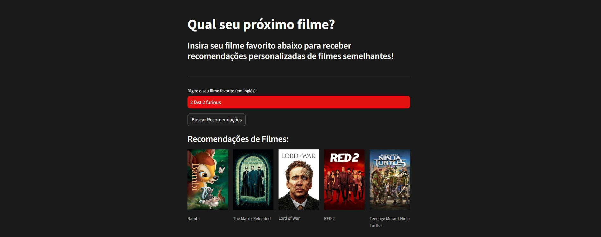

# 🎬 Movie Recommender App

Welcome to **Movie Recommender App**—an intelligent movie suggestion platform powered by the ratings of millions worldwide! Simply enter your favorite movie, and our recommendation engine will find films that resonate with your taste, taking cues from global movie ratings

## 🔥 Features

- **User-Friendly Interface**: Simple, single-page layout to keep your experience focused on movie discovery.
- **Real-Time Recommendations**: Our app utilizes a K-Nearest Neighbors model to instantly generate recommendations based on your input.
- **Dynamic Movie Posters**: Each recommended film includes a movie poster fetched directly from TMDB, making it easy to explore options visually.
- **Smart Suggestions**: Our model leverages user ratings data and movie features to find the closest matches to your taste.

## 🛠️ Built With

- **Streamlit**: For a responsive and engaging web interface.
- **Scikit-learn**: Machine learning for the recommendation model.
- **TMDB API**: To fetch real-time movie posters for a visually rich experience.
- **Python & Pickle**: Data handling, processing, and model storage.

## 🚀 How It Works

1. **Data Preparation**: Using a large dataset of movie ratings and titles, we filter and clean the data, focusing on high-quality, English-language movies.
2. **Machine Learning Model**: We trained a K-Nearest Neighbors model on a sparse matrix of movie ratings to identify movies similar to the user’s choice.
3. **Real-Time Poster Fetching**: Using the TMDB API, we retrieve posters for recommended movies dynamically, so you always see the latest information.

## 📸 App Demo

Here's a sneak peek of the Movie Recommender App in action! Enter a title, hit "Search", and get personalized suggestions, complete with posters.



## 🔑 API Key Protection

To protect our TMDB API key, I've kept it secure by loading it via environment variables. This ensures the app remains secure and ready for deployment.

## 💻 Getting Started

### Prerequisites

- Python 3.8+
- Streamlit
- Scikit-learn
- dotenv (if using environment variables for API key)

### Installation

1. **Clone this repository**:
   ```bash
   git clone https://github.com/yourusername/movie-recommender-app.git
   cd movie-recommender-app

2. **Install dependencies**:
    ```bash
    pip install -r requirements.txt

3. **Set up API Key**:

    Option 1: Add the TMDB API key directly in your environment variables.
    Option 2: Create a .env file with the line TMDB_API_KEY=your_api_key_here.

4. **Run the app**:
    ```bash
    streamlit run Main.py

🎉 Enjoy the Recommendations!

Head over to the app, type in your favorite movie, and let the adventure begin. I hope this tool brings you hours of movie magic!
